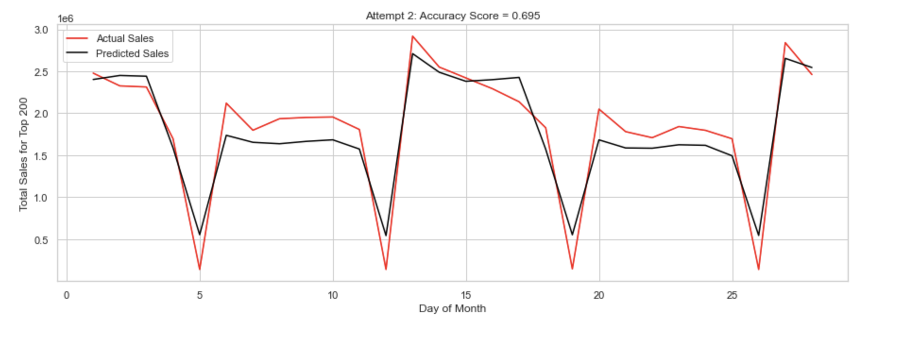

# Summary: Actual vs Predicted Sales Forecast

## What the chart shows

This chart (titled **"Attempt 2: Accuracy Score = 0.695"**) plots two line series across the days of a month (x-axis: Day of Month, 0–28) against **Total Sales for Top 200** stores (y-axis, in units of 1e6):

- **Actual Sales** (red line)
- **Predicted Sales** (black line)

## Key observations

- **Overall fit:** The predicted line tracks the actual line closely for most of the month, correctly following the general shape and timing of the sales pattern. The model achieves an accuracy score of **0.695**.
- **Repeated weekly dips:** Both series show sharp, recurring drops roughly every 6–7 days (around days 5, 12, 19, and 26), consistent with a weekly cycle (e.g., a low-sales day such as Sunday). The model captures both the timing and depth of these dips very well.
- **Sharp rebounds:** After each dip, sales rebound quickly to ~1.6–2.0 million, and the predicted line follows this recovery closely.
- **Peak days:** The highest sales values occur around day 13 (~2.9M actual) and day 27 (~2.85M actual), both of which coincide with promotional or otherwise elevated-demand periods. The model captures these peaks reasonably well, though it slightly underestimates the actual peak height on day 13 and day 27.
- **Mid-range divergence:** Between roughly days 14–18 and days 20–25, actual sales trend gradually downward while predicted sales stay comparatively flat or decline more slowly, causing the two lines to diverge somewhat in this stretch — the model's main source of error.
- **Baseline range:** Outside of the dips, both actual and predicted sales generally sit in the 1.5–2.5 million range.

## Takeaway

The model (Attempt 2) reproduces the overall monthly sales pattern — including sharp weekly troughs and demand peaks — fairly well, with an accuracy score of 0.695. Its main weakness is in mid-range periods where it fails to track gradual declines in actual sales as closely as it does the sharp cyclical swings.
