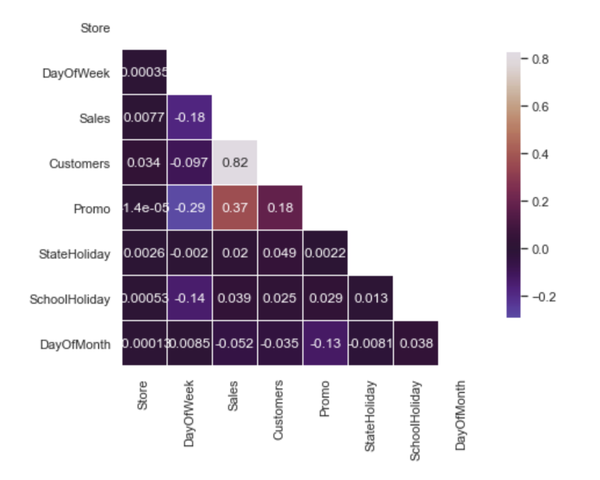

# Summary: Correlation Heat Map

## What the chart shows

This lower-triangular heat map displays the pairwise Pearson correlation coefficients between the numeric and categorical-encoded features in the Rossmann dataset: **Store**, **DayOfWeek**, **Sales**, **Customers**, **Promo**, **StateHoliday**, **SchoolHoliday**, and **DayOfMonth**. Each cell shows the correlation value between the row and column variable, with a diverging color scale (blue = negative, dark purple = near zero, tan/white = strongly positive, ranging roughly from -0.2 to 0.8).

## Key observations

- **Sales ↔ Customers (0.82):** By far the strongest relationship in the matrix. The number of customers visiting a store is a near-direct driver of sales, as expected.
- **Sales ↔ Promo (0.37):** A moderate positive correlation — running a promotion is associated with a meaningful increase in sales.
- **Customers ↔ Promo (0.18):** A weaker positive link, suggesting promotions draw in somewhat more foot traffic, though the effect is smaller than their effect on sales directly.
- **Sales ↔ DayOfWeek (-0.18)** and **Promo ↔ DayOfWeek (-0.29):** Both show mild negative correlation, reflecting that sales and promotional activity are not evenly distributed across the week (e.g., lower on certain days such as Sundays).
- **SchoolHoliday ↔ DayOfWeek (-0.14):** A minor negative association, indicating school holidays are not uniformly distributed across weekdays.
- **Store, StateHoliday, DayOfMonth:** These variables show negligible correlation (mostly under 0.05 in magnitude) with almost every other feature, implying they carry little linear relationship with sales on their own and may act more as categorical/contextual features than direct linear predictors.

## Takeaway

**Customers** is the dominant linear predictor of **Sales**, with **Promo** as a secondary contributor. Most other features (Store, StateHoliday, DayOfMonth, DayOfWeek) show weak-to-negligible linear correlation with Sales individually, suggesting their predictive value — if any — is more likely to come through interaction effects or non-linear patterns rather than direct linear association.
